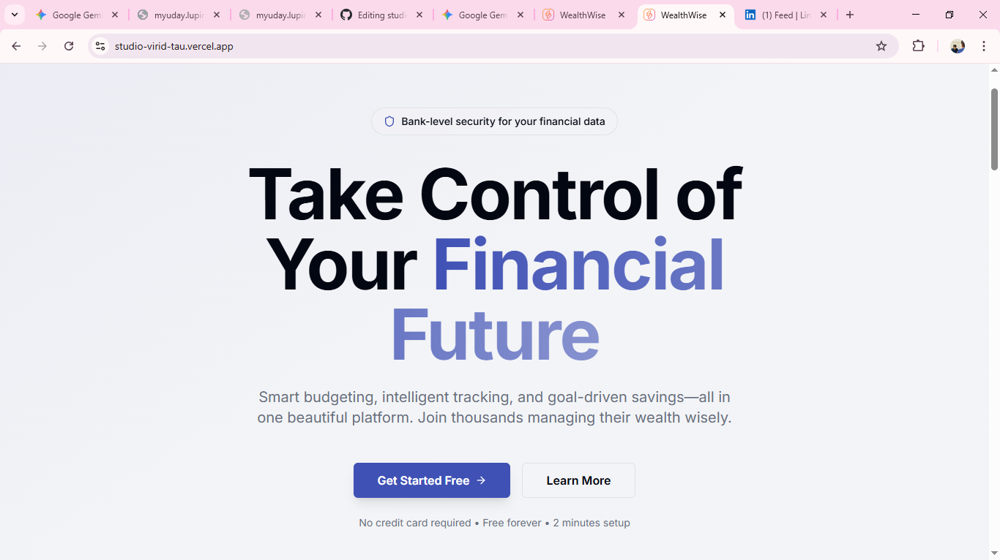
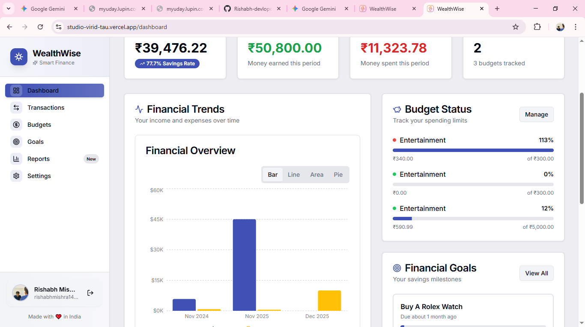
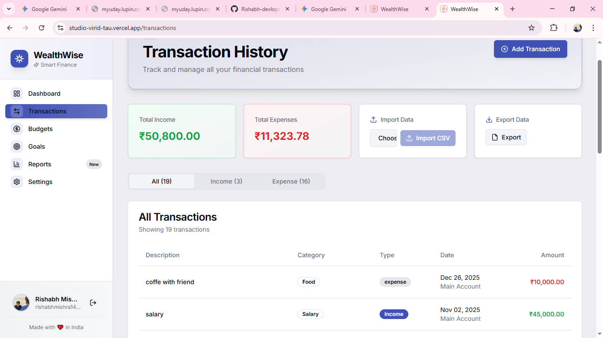
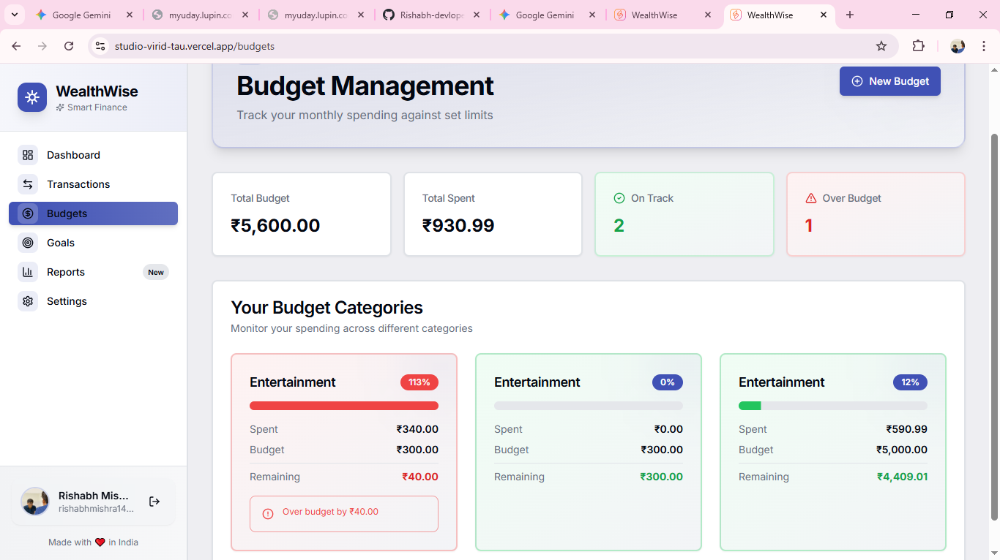

# 💰 WealthWise - Smart Personal Finance Tracker

 


## 🚀 Live Demo
[**Click here to view the live application**](https://studio-virid-tau.vercel.app/)

---

## 📖 Overview

**WealthWise** is a full-stack personal finance management application designed to help users track their income, expenses, and savings goals with precision. Built as a comprehensive minor project, it leverages the latest web technologies to provide a seamless, bank-grade user experience.

Unlike simple expense trackers, WealthWise features **CSV bulk imports**, **visual analytics**, and **smart budgeting algorithms** to provide actionable financial insights.

---

## ✨ Key Features

- **📊 Interactive Dashboard:** Real-time overview of current balance, income, expenses, and savings rate.
- **📝 Transaction Management:** - Full CRUD operations for transactions.
  - **CSV Import:** Bulk upload bank statements for quick data entry.
  - **CSV Export:** Download financial data for external analysis.
- **📉 Visual Analytics:** Dynamic charts (Bar, Area, Pie, Radar) to visualize spending trends and category breakdowns.
- **💰 Smart Budgeting:** Set category-specific budgets with visual alerts when limits are exceeded.
- **🎯 Financial Goals:** Create savings milestones (e.g., "Trip to Goa", "New Laptop") and track progress.
- **📱 Fully Responsive:** Optimized interface for Desktop, Tablet, and Mobile devices using Tailwind CSS.
- **🔐 Secure Authentication:** Robust user management powered by Clerk.

---

## 🛠️ Tech Stack

This project uses a modern, "Bleeding Edge" serverless architecture:

### Frontend
- **Framework:** [Next.js 15](https://nextjs.org/) (App Router)
- **Language:** TypeScript
- **Styling:** [Tailwind CSS](https://tailwindcss.com/)
- **UI Components:** [Shadcn UI](https://ui.shadcn.com/)
- **State Management:** [TanStack Query](https://tanstack.com/query/latest) (React Query) for server-state caching.
- **Form Handling:** React Hook Form + Zod (Schema Validation).

### Backend & Database
- **API Framework:** [Hono.js](https://hono.dev/) (RPC for type-safe API calls).
- **Database:** [PostgreSQL](https://www.postgresql.org/) (via [Neon DB](https://neon.tech/) Serverless).
- **ORM:** [Drizzle ORM](https://orm.drizzle.team/) (Lightweight & Type-safe).
- **Authentication:** [Clerk](https://clerk.com/).

---

## 📸 Screenshots

| Dashboard | Transactions & CSV |
|:---:|:---:|
|  |  |

| Budget Management | Financial Goals |
|:---:|:---:|
|  |  |

*(Note: Create a folder named `screenshots` in your repo and upload your images there for these to work)*

---

## ⚙️ Local Development Setup

Follow these steps to run the project locally on your machine.

### 1. Clone the repository
```bash
git clone [https://github.com/your-username/wealthwise.git](https://github.com/your-username/wealthwise.git)
cd wealthwise
